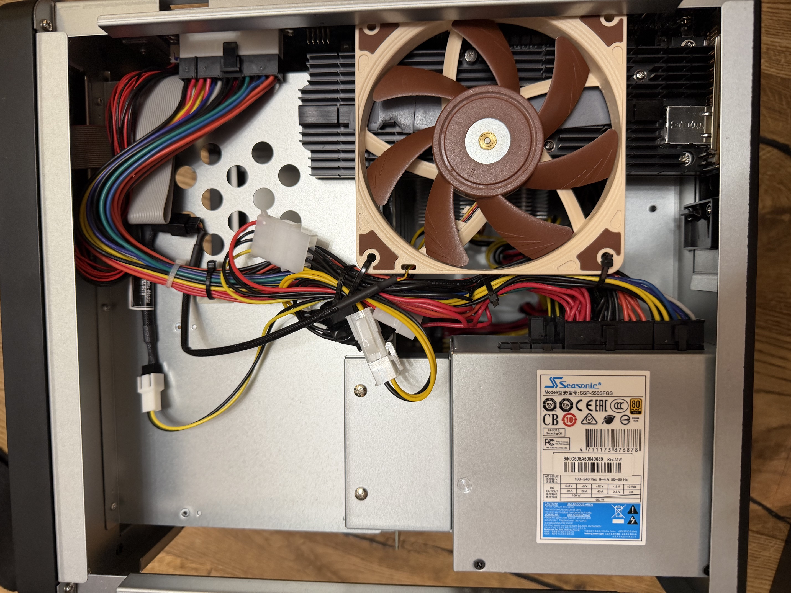

# DS3622xs+ E10M20-T1 NVMe cooling

[← Repository guide index](../README.md) · [128 GB RAM upgrade](128gb-ram-upgrade.md) · [Unsupported drives and NVMe cache](../README.md#unsupported-drives--m2-read-write-cache)

This guide documents the active-airflow modification used for a Synology
E10M20-T1 carrying two enterprise NVMe SSDs in a DS3622xs+.

## Tested hardware

| Component | Hardware |
|---|---|
| NAS | Synology DS3622xs+ |
| PCIe card | Synology E10M20-T1 with integrated 10GbE |
| NVMe SSDs | **2× Samsung PM983 3.84 TB M.2 NVMe** |
| SSD model | **MZ-1LB3T80** |
| Additional fan | **Noctua NF-A12x15 FLX** |
| Fan size | **120 × 120 × 15 mm** slim profile |
| Fan connection | **3-pin, 12 V** |
| P4 donor extensions | **2× Akyga AK-CA-78**, 23 cm, P4 male-to-female, modified |
| P4/Molex adapter | **Akyga AK-CA-12**, 15 cm |
| Molex/3-pin adapter | **Akyga AK-CA-35**, 15 cm |
| Custom lead | Female-to-female P4 lead assembled from the two modified AK-CA-78 cables |
| Fan-speed adapter | Noctua intermediate Low-Noise Adapter; not the lowest-speed option |



*Installed cooling arrangement with the DS3622xs+ side/top access open. The slim
120 mm fan lies horizontally over the E10M20-T1 heatsink area. The cable bundle
and power adapters are routed along the fan's left side.*

## What the installation photo confirms

- The NF-A12x15 FLX is installed **flat/horizontally**, directly over the black
  finned E10M20-T1 heatsinks rather than on the rear chassis panel.
- At least two black cable ties are visible through the fan's left-side mounting
  holes. They secure the fan and keep the adjacent harness away from the blades.
- The unobstructed blade/intake face appears to face upward, so the pictured
  orientation appears to direct air downward onto the heatsinks. This airflow
  direction is an inference from normal axial-fan construction and should be
  confirmed from the fan-frame arrows during installation.
- The white P4/Molex connectors, the black inline Noctua adapter, and the bundled
  power wiring are visible. The custom splice and its pinout are not exposed
  clearly enough in this overview photo to copy safely.
- This is the only installation photo available. It documents the useful fan
  position, but it is not a wiring diagram and does not establish the hidden
  splice, wire joints, connector pinout, or final 3-pin output polarity.

## Why add a fan?

During normal NAS use, the two PM983 SSDs operated acceptably. Sustained
benchmarks exposed a different problem: the SSDs became hot enough that the
benchmark could eventually fail from overheating.

The E10M20-T1 includes heatsinks, but heatsinks still need airflow. The slim
Noctua fan was positioned to move air directly across the E10M20-T1 heatsinks and
both PM983 SSDs. After the modification, sustained high-load benchmarks behaved
much better and the overheating-related failures were no longer observed.

This modification is **not required** for the 128 GB RAM upgrade or for the
third-party-drive scripts. It addresses a separate thermal issue that appears
under sustained NVMe load.

> [!WARNING]
> This is an unofficial chassis modification. Incorrect mounting can short a
> component, block the NAS airflow path, foul a fan blade, overload a power source,
> or allow a loose fan to damage the card. Shut down and disconnect the NAS before
> working inside it. Use ESD precautions and proceed at your own risk.

## Installation principles

The exact position is best documented with a photo because clearances depend on
the installed PCIe card, cables, and chassis. The working installation followed
these principles:

1. **Direct the airflow across the E10M20-T1 heatsinks.** The purpose is airflow
   over both NVMe locations, not simply more air somewhere inside the chassis.
2. **Preserve the NAS airflow path.** Avoid placing the fan so it fights the rear
   chassis fans or creates a dead zone around the CPU, memory, or drives.
3. **Keep safe clearance.** Check both faces of the fan, the blades, the E10M20-T1,
   memory, motherboard, chassis panels, and every cable before closing the NAS.
4. **Mount it securely and non-conductively.** In the photographed installation,
   the fan is laid flat over the heatsink area and black cable ties pass through
   its mounting holes. The fan must not move during transport or vibration, and no
   tie or other fastener should contact PCB traces or components.
5. **Route the cable away from blades and hot components.** Secure enough slack for
   servicing, but do not leave a loop that can enter a fan.
6. **Verify the complete 12 V power path.** The NF-A12x15 FLX is a 3-pin, 12 V
   fan. Connector shape, gender, or wire colour alone does not prove that polarity
   and pinout are correct. Check continuity and polarity before attaching the fan
   or connecting the harness to the NAS.
7. **Test with the chassis open, then closed.** Verify that the added fan starts
   reliably, does not rub, and does not trigger fan or power warnings before
   returning the NAS to service.

The overview photo documents the fan's position and visible cable-tie mounting.
The donor cables were two [Akyga AK-CA-78 P4 4-pin 23 cm extension
cables](https://allegro.pl/oferta/przedluzacz-zasilania-p4-4-pin-akyga-ak-ca-78-kabel-do-procesora-cpu-23cm-18681209197).
The [manufacturer's specification](https://pl.akyga.com/produkty/1038-przedluzacz-p4-4-pin-23-cm-ak-ca-78.html)
identifies each unmodified AK-CA-78 as a 23 cm cable with one P4 male and one P4
female connector. Two were modified and joined to form the custom female-to-female
P4 lead used in this installation; an unmodified AK-CA-78 is not female-to-female.
Treat the power-chain description as a record of this installation, not as a
complete pinout or a directly reproducible wiring plan. Anyone building a similar
harness must independently verify every wire, continuity, voltage, and polarity.

## Fan power adapter chain

The installed fan was not connected directly to an unidentified motherboard fan
header. Its 3-pin, 12 V supply was assembled from the following parts:

1. **Two [Akyga AK-CA-78](https://allegro.pl/oferta/przedluzacz-zasilania-p4-4-pin-akyga-ak-ca-78-kabel-do-procesora-cpu-23cm-18681209197)
   donor cables** were used. Each stock AK-CA-78 is a 23 cm P4 extension with one
   male and one female connector. The two cables were modified and joined to
   create a custom P4 female-to-female lead. The conductors were joined using
   soldered/secured wire connections and insulated. The stock AK-CA-78 cannot be
   used as a female-to-female lead without modification.
2. [**Akyga AK-CA-12**](https://allegro.pl/oferta/kabel-molex-p4-4-pin-akyga-ak-ca-12-procesor-15cm-11449850255)
   — a 15 cm adapter with a male peripheral Molex connector and female P4 4-pin
   connector. The listing specifies 18 AWG conductors and a maximum load of 3 A
   at 12 V.
3. [**Akyga AK-CA-35**](https://allegro.pl/oferta/kabel-molex-3-pin-12v-molex-akyga-ak-ca-35-15cm-13669511291)
   — a 15 cm adapter with a female peripheral Molex input and male Molex
   passthrough plus a 3-pin, 12 V fan output. The listing specifies 20 AWG
   conductors and a maximum load of 6 A at 12 V.
4. The Noctua fan was connected to the resulting 3-pin output.
5. An included Noctua **Low-Noise Adapter** was used between the power adapter and
   fan. The installed adapter was the intermediate/middle-speed choice, not the
   most restrictive lowest-speed option. Running at full speed or selecting a
   different supplied adapter is a noise/temperature decision for the user.

In simplified form, the intended chain is:

```text
NAS power connection
  → custom female-to-female P4 lead (made from 2× modified Akyga AK-CA-78)
  → Akyga AK-CA-12 (P4 / Molex)
  → Akyga AK-CA-35 (Molex / 3-pin 12 V)
  → optional Noctua Low-Noise Adapter
  → Noctua NF-A12x15 FLX
```

> [!DANGER]
> Do not reproduce this harness from connector names alone. Verify the actual NAS
> source, every pin, continuity, 12 V polarity, and the absence of shorts with a
> multimeter before connecting the fan. Insulate every splice individually, add
> strain relief, keep exposed conductors away from the chassis and PCBs, and ensure
> the total fan current is below the rating of the source and the weakest adapter.
> A reversed or shorted custom lead can damage the fan, NAS power supply,
> motherboard, E10M20-T1, or storage devices.

For this chain, the published 3 A at 12 V rating of the AK-CA-12 is lower than the
published 6 A rating of the AK-CA-35, so the assembled path must never be treated
as having the higher adapter's rating. The NAS source and custom lead may impose
lower limits still.

## Suggested procedure

1. Stop storage benchmarks and confirm that no storage-pool, cache, scrub, or
   rebuild operation is running.
2. Record the current idle and sustained-load temperature of both NVMe SSDs.
3. Shut the NAS down normally and disconnect all cables.
4. Remove the relevant chassis panel using the normal DS3622xs+ access procedure.
5. Inspect the E10M20-T1, its heatsinks, nearby cables, and available fan clearance.
6. Lay the Noctua NF-A12x15 FLX horizontally over the E10M20-T1 heatsink area as
   shown in the installation photo. Confirm the frame's airflow arrows point
   toward the heatsinks before securing it.
7. Assemble and continuity-test the custom female-to-female P4 lead made from the
   two modified AK-CA-78 cables and the remaining Akyga adapter chain outside the
   NAS. Confirm the expected 12 V polarity at the final 3-pin output before
   connecting the fan.
8. Connect the fan directly for full speed or use the selected Noctua Low-Noise
   Adapter. Confirm that the fan starts reliably at the selected speed.
9. Secure the complete harness and fan cable away from all fan blades, PCB edges,
   heatsinks, and chassis pinch points.
10. Before closing the chassis, power on briefly and confirm correct fan operation,
   airflow direction, and clearance. Shut down again before making adjustments.
11. Reassemble the NAS and confirm that the E10M20-T1, 10GbE interface, both NVMe
   SSDs, storage pool, and cache appear normally.
12. Repeat the same sustained workload used for the baseline while watching both
    SSD temperatures and system logs.

## Monitoring and validation

On DSM, query each NVMe with Synology's tool:

```sh
sudo synonvme --smart-info-get /dev/nvme0n1
sudo synonvme --smart-info-get /dev/nvme1n1
```

Depending on what is installed, `nvme smart-log` may also be available. DSM's old
bundled `smartctl` can fail against newer NVMe with `NVMe Status 0x4002`; that does
not by itself prove the SSD is unhealthy.

Validate more than the temperature shown at idle:

- record both SSD temperatures before the benchmark;
- use the same benchmark duration and workload for before/after comparison;
- watch for throttling, benchmark errors, I/O errors, controller resets, and
  critical-temperature events;
- verify the SSD cache after testing;
- check that CPU, HDD, and system temperatures did not worsen because the new fan
  altered the chassis airflow.

For the documented machine, the useful result was practical rather than a claimed
universal temperature delta: sustained benchmarks stopped failing from the
overheating behavior seen before the fan was added.

## Relationship to the unsupported-drive guide

The E10M20-T1 and PM983 SSDs are also used by the repository's
[third-party NVMe read-write-cache procedure](../README.md#unsupported-drives--m2-read-write-cache).
Cooling does not whitelist the SSDs or unlock DSM's cache-creation path; use the
drive/cache guide for that. Conversely, the whitelist does not solve inadequate
airflow under sustained load.

If you temporarily remove or recreate the SSD cache while changing the hardware,
follow the removal and recreation sequence in the root guide. Do not pull a cached
SSD or card from a running system.

## Limits of this result

- The result is specific to an E10M20-T1 with two Samsung PM983 3.84 TB
  `MZ-1LB3T80` SSDs and the described fan.
- Workload, ambient temperature, dust, fan mode, heatsink contact, and chassis
  placement all affect temperatures.
- A benchmark no longer failing is useful evidence, but long-term temperature and
  error monitoring are still required.

---

[← Back to the repository guide index](../README.md)
